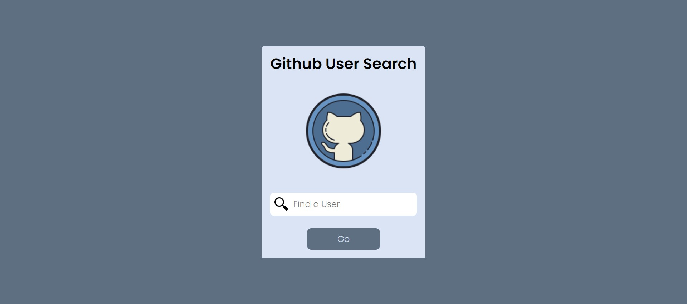

### Publication

- [`githubsearch`](https://githubsearch-dindachyfr.netlify.app/)

<h1  align="center">Github Search</h1>



## Getting started

To get the React app running locally:

- Clone this repo with `git clone https://github.com/dindachyfr/githubsearch tebengan-ina`
- `cd tebengan-ina`
- `npm install` to install all required dependencies
```

- `npm start` to start the local development server
- start your browser and open `http://localhost:3000`

## Architechture

This project is using :

1. ReactJS ( Framework )
2. Redux
3. Axios

## Features

The features in this project include:

- Search a github user
- Show one's list of repositories
- show one's detail of repository
